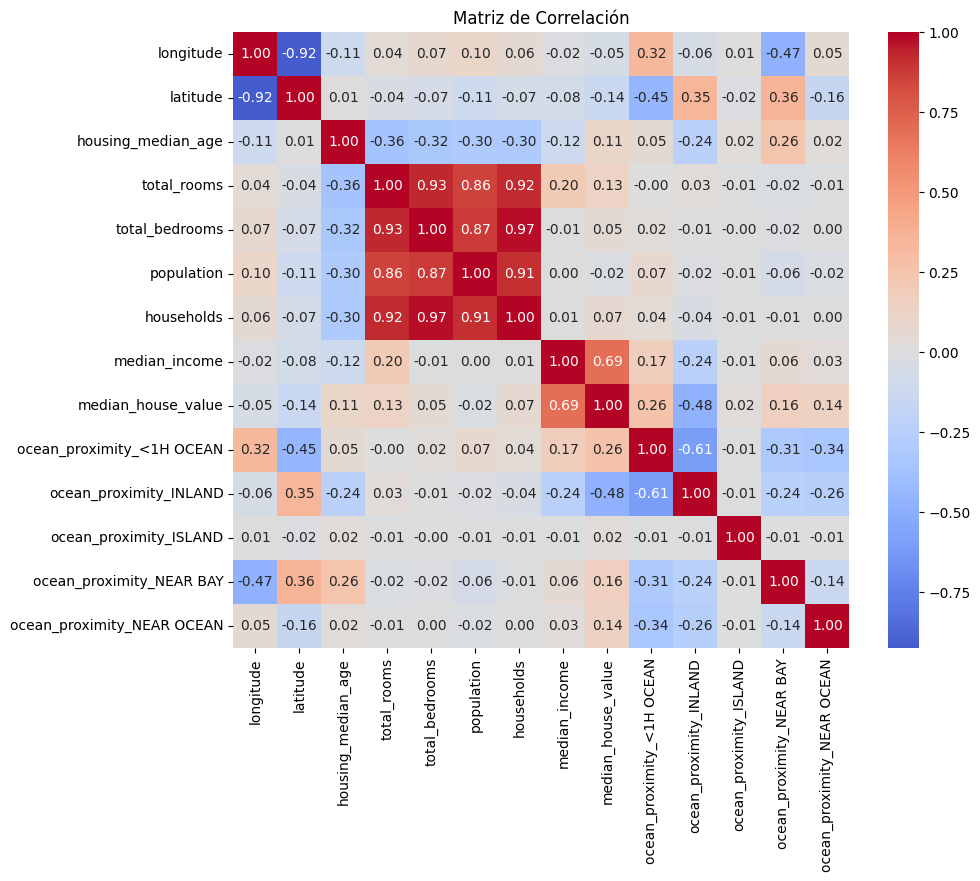
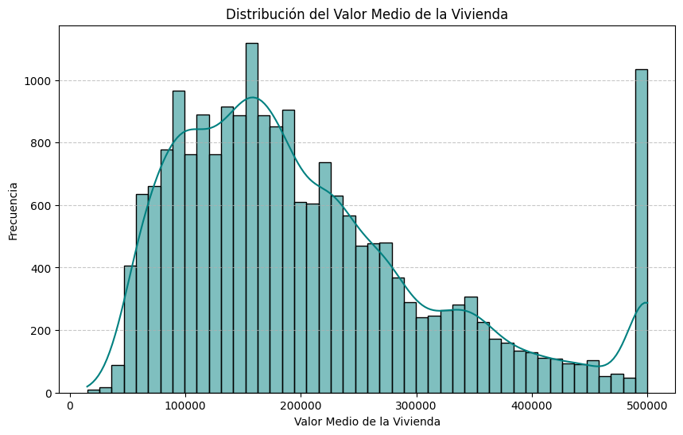
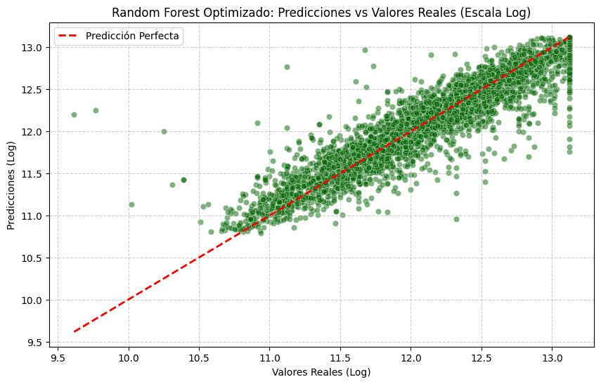
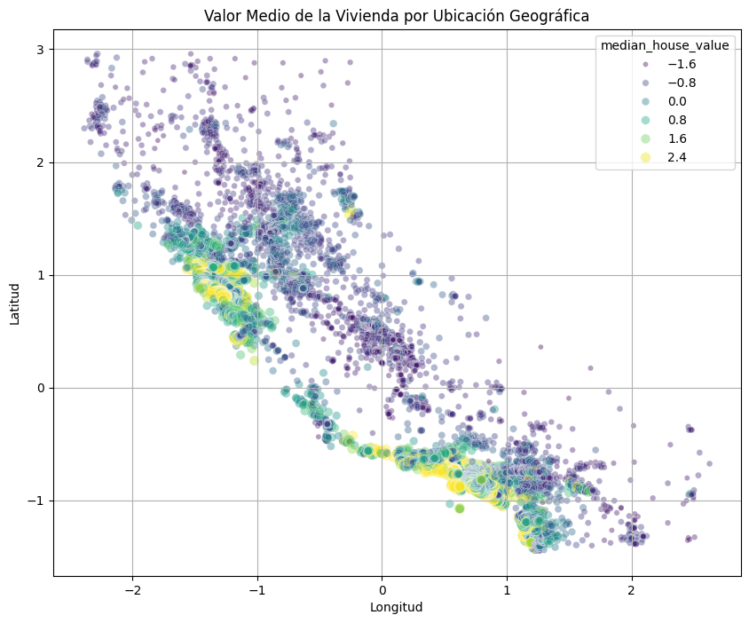

# California-House-Modeling

Academic machine learning project developed during the Modeling and Simulation I course as part of the Mathematics undergraduate program.

The objective of this project was to analyze a housing dataset and build predictive models capable of estimating property prices based on physical, geographical, and socioeconomic characteristics.

---

## Objectives

* Perform Exploratory Data Analysis (EDA).
* Identify relevant variables for price prediction.
* Apply data cleaning and preprocessing techniques.
* Build and compare different predictive models.
* Evaluate model performance using regression metrics.
* Analyze underfitting and overfitting behavior.

---

## Methodology

### Exploratory Data Analysis (EDA)

* Descriptive statistics
* Outlier detection
* Correlation analysis
* Data visualization
* Geographic analysis using latitude and longitude variables

### Data Preprocessing

* Missing value imputation
* One-Hot Encoding
* Feature scaling
* Feature selection

### Predictive Models

* Linear Regression
* Ridge Regression
* Lasso Regression
* Polynomial Regression
* Random Forest Regressor
* Neural Networks (MLP)

### Model Optimization

* Hyperparameter tuning
* Model comparison
* Performance evaluation

---

## Evaluation Metrics

The models were evaluated using:

* R² Score (Coefficient of Determination)
* RMSE (Root Mean Squared Error)
* MAE (Mean Absolute Error)

---

## Technologies Used

* Python
* Pandas
* NumPy
* Matplotlib
* Scikit-Learn
* TensorFlow / Keras (if applicable)

---

## Results

### Correlation Analysis



The correlation matrix was used to identify relationships between numerical variables and their influence on housing prices.

### Target Variable Distribution



The distribution of the target variable was analyzed to understand its behavior and identify potential skewness affecting model performance.

### Model Comparison


Multiple regression models were evaluated using R², MSE and MAE metrics. Random Forest achieved the strongest predictive performance among the tested approaches.

### Actual vs Predicted Values



This visualization compares real housing prices against model predictions, illustrating the predictive capability of the optimized Random Forest model.

### Feature Importance


Feature importance analysis was performed to identify the variables with the greatest influence on housing price estimation.

### Geographic Analysis



Geographical distribution of observations was explored using latitude and longitude variables to identify spatial patterns in housing prices.

---

## Repository Structure

```text
house-prices-modeling
│
├── README.md
├── house_prices_modeling.ipynb
├── requirements.txt
│
├── data/
│   └── dataset.csv
│
├── images/
│   ├── correlation_matrix.png
│   ├── residual_analysis.png
│   ├── feature_importance.png
│   └── model_comparison.png
```

---

## Author

Jacobo Lopez

Mathematics Undergraduate Student

Fundación Universitaria Konrad Lorenz

Colombia
